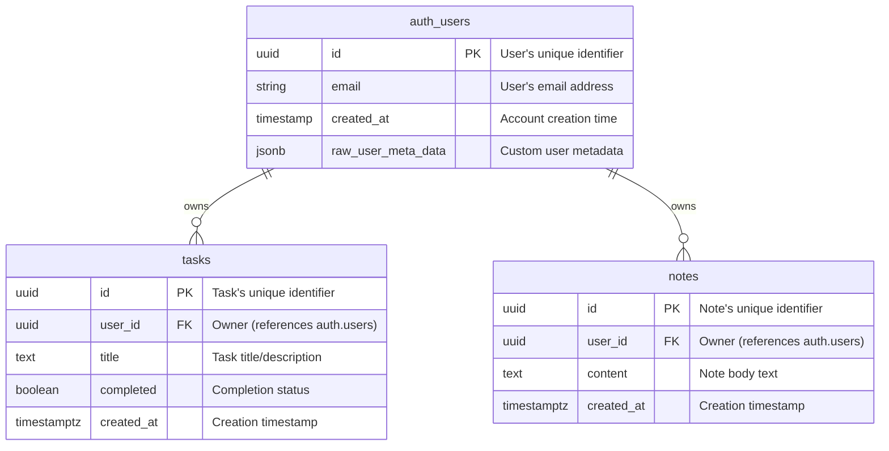

# Database Schema

This document describes the database schema for the Task Manager application.

---

## Overview

The Task Manager uses **Supabase** (PostgreSQL) with the following architecture:

- **Authentication**: Managed by Supabase Auth (`auth.users` table)
- **User Data**: Custom tables with foreign keys to `auth.users`
- **Security**: Row Level Security (RLS) enforces per-user data isolation

---

## Entity-Relationship Diagram



---

## Tables

### `auth.users` (Supabase Managed)

This table is **automatically managed by Supabase Auth**. Do not modify directly.

| Column | Type | Description |
|--------|------|-------------|
| `id` | `uuid` | Primary key, user's unique identifier |
| `email` | `varchar` | User's email address |
| `encrypted_password` | `varchar` | Hashed password (never exposed) |
| `created_at` | `timestamptz` | Account creation timestamp |
| `updated_at` | `timestamptz` | Last update timestamp |
| `raw_user_meta_data` | `jsonb` | Custom user metadata |

> **Note**: Additional columns exist but are managed internally by Supabase.

---

### `public.tasks`

Stores user tasks with completion tracking.

| Column | Type | Constraints | Default | Description |
|--------|------|-------------|---------|-------------|
| `id` | `uuid` | `PRIMARY KEY` | `gen_random_uuid()` | Unique task identifier |
| `user_id` | `uuid` | `NOT NULL`, `REFERENCES auth.users(id) ON DELETE CASCADE` | - | Task owner |
| `title` | `text` | `NOT NULL` | - | Task title/description |
| `completed` | `boolean` | - | `FALSE` | Whether task is done |
| `created_at` | `timestamptz` | - | `NOW()` | Creation timestamp |

**Indexes:**
- `idx_tasks_user_id` on `(user_id)` — Fast user-specific queries
- `idx_tasks_completed` on `(user_id, completed)` — Filter by status

**RLS Policies:**
- Users can only SELECT, INSERT, UPDATE, DELETE their own tasks

---

### `public.notes`

Stores user notes and memos.

| Column | Type | Constraints | Default | Description |
|--------|------|-------------|---------|-------------|
| `id` | `uuid` | `PRIMARY KEY` | `gen_random_uuid()` | Unique note identifier |
| `user_id` | `uuid` | `NOT NULL`, `REFERENCES auth.users(id) ON DELETE CASCADE` | - | Note owner |
| `content` | `text` | `NOT NULL` | - | Note body text |
| `created_at` | `timestamptz` | - | `NOW()` | Creation timestamp |

**Indexes:**
- `idx_notes_user_id` on `(user_id)` — Fast user-specific queries

**RLS Policies:**
- Users can only SELECT, INSERT, UPDATE, DELETE their own notes

---

## Row Level Security (RLS)

All user-data tables have **RLS enabled**. This provides database-level security:

### How RLS Works

```
┌─────────────┐     Query      ┌─────────────┐     RLS Check     ┌──────────────┐
│   Client    │ ─────────────► │  Supabase   │ ─────────────────► │  PostgreSQL  │
│   (User A)  │                │   API       │                    │  Database    │
└─────────────┘                └─────────────┘                    └──────────────┘
                                     │                                   │
                                     │  JWT contains user_id             │
                                     │                                   │
                                     ▼                                   ▼
                              auth.uid() = User A's ID          Filter: user_id = auth.uid()
                                                                 → Only User A's rows returned
```

### Policy Summary

| Table | Operation | Policy | Enforcement |
|-------|-----------|--------|-------------|
| `tasks` | SELECT | Own tasks only | `auth.uid() = user_id` |
| `tasks` | INSERT | Own user_id only | `auth.uid() = user_id` |
| `tasks` | UPDATE | Own tasks only | `auth.uid() = user_id` |
| `tasks` | DELETE | Own tasks only | `auth.uid() = user_id` |
| `notes` | SELECT | Own notes only | `auth.uid() = user_id` |
| `notes` | INSERT | Own user_id only | `auth.uid() = user_id` |
| `notes` | UPDATE | Own notes only | `auth.uid() = user_id` |
| `notes` | DELETE | Own notes only | `auth.uid() = user_id` |

### Security Guarantees

✅ **User A cannot see User B's tasks or notes**  
✅ **User A cannot modify User B's data**  
✅ **Unauthenticated requests have no access**  
✅ **Security is enforced at database level** (not application level)

---

## Foreign Key Behavior

All foreign keys use `ON DELETE CASCADE`:

- When a user is deleted from `auth.users`
- All their `tasks` are automatically deleted
- All their `notes` are automatically deleted

This ensures no orphaned data exists.

---

## Migrations

SQL migrations are located in `/supabase/migrations/`:

| File | Description |
|------|-------------|
| `001_create_tables.sql` | Creates `tasks` and `notes` tables |
| `002_enable_rls.sql` | Enables Row Level Security |
| `003_rls_policies.sql` | Creates all RLS policies |

### Running Migrations

**Option 1: Supabase Dashboard**
1. Go to SQL Editor
2. Copy and paste each migration file
3. Run in order (001 → 002 → 003)

**Option 2: Supabase CLI**
```bash
supabase db push
```

---

## Future Considerations

Potential schema extensions:

- **Categories table**: Organize tasks into categories
- **Task priorities**: Add priority levels (low, medium, high)
- **Due dates**: Add deadline tracking
- **Soft deletes**: Add `deleted_at` column for recovery
- **Audit log**: Track all changes for compliance
